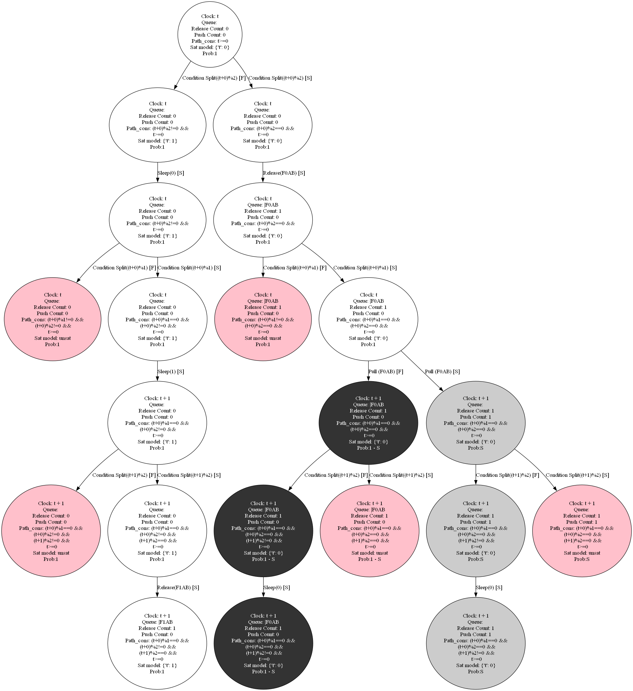
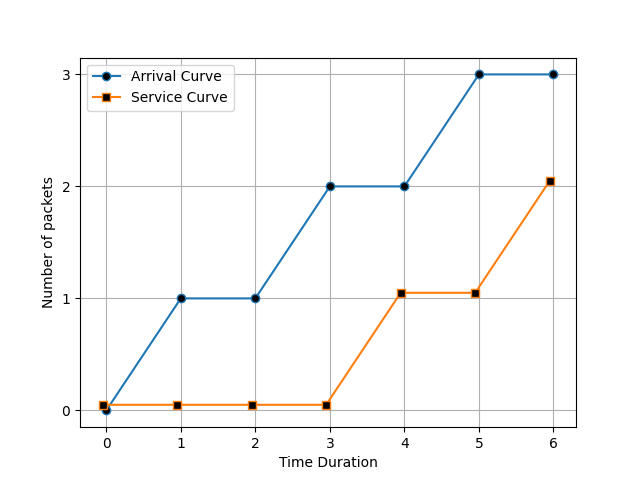

# Network Code Simulator

 To analyse network codes, which include if-conditions, we wrote a simulator to process these codes by executing all the possible outcomes and returning the arrival and service curve.


 ## Input
As this project is still under development, the input of this simulator is currently a function that is hard-coded in the Launcher file. But, the goal is to have a parser for individual files as the input for the simulator. However, to understand the type of network code that we use to simulate, you can see the below sudo code.

```
let int S = 1
let int R = 2
queue q
clock = symbol('t')

while(True):
    if clock % R == 0:
        q.push(new packet)
    
    if clock % S == 0:
        if !q.empty():
            p = q.pop()
            push(p)

    clock = clock + 1
```


## Process
The project involves analyzing a network code simulator that tracks program states and considers conditions like transmission queues and clocks. The simulator generates feasible states by forking at if-conditions, utilizing path constraints and SMT solvers. The execution progresses through a graph (as you can see below the execution graph for one iteration), and a hash table efficiently stores unique states for scalability.




## Output
 The simulator calculates cumulative release functions, generating arrival curves. To find the minimum service curve, it explores feasible paths in the execution graph, comparing and selecting the most efficient curve. The resulting arrival and service curves are plotted for visualization.

 

## How to run
To run the simulator first you have to install the list of libraires which have been used in this project and then run the [Launcher](./Launcher.py) file using python interpreter. Moreover, if you want to simulate a different network code you can use the [Simulator](./Simulator.py) as a library to call the desired function. However, as said in above this project is still under developement and the user-interface would be created at the end.

##### List of libraries
* graphviz
* sympy
* z3
* matplotlib
* numpy